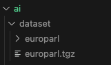
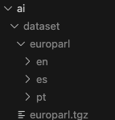
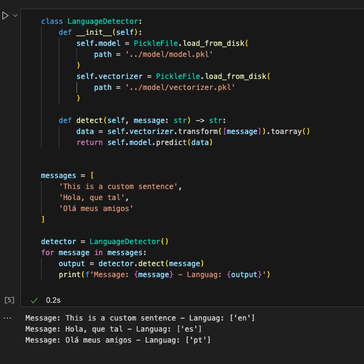
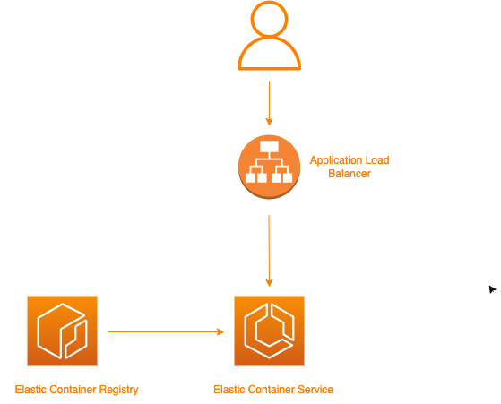
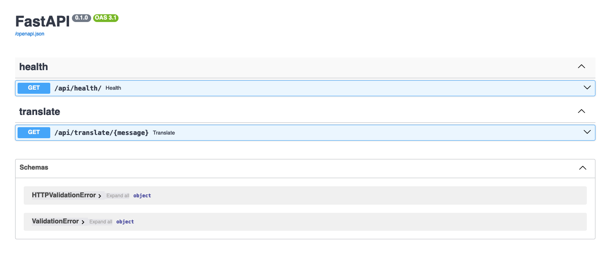
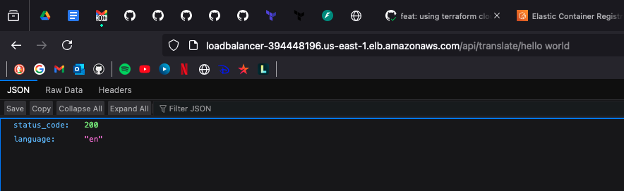

# language-detector
A simple Python service that identifies the language given a certain sentence (pt, en or es). It uses an AI model to identify the correct language.

## Index
- [Generating the AI model](#generating-the-ai-model)
    - [Download the dataset](#download-the-dataset)
    - [Training the model](#training-the-model)
    - [Testing the model](#testing-the-model)
- [Language Detector service](#language-detector-service)
    - [Architecture](#architecture)
    - [Deploying the microservice](#deploying-the-microservice)
    - [Using the service](#using-the-service)
    - [Testing the service](#testing-the-service)


## Generating the AI model
Everything I'll be doing here, we'll use the folder ```./ai/```.

### Download the dataset
First of all you must [download this dataset](https://www.statmt.org/europarl/), decompress it and save the content in ```dataset/europarl/```.



> For study purpose I trained the model using just sentences in Portuguese, English and Spanish. So I deleted all the other folders and kept just the follow ones:




### Training the model
Now, on the root path, you must start the virtual environment to install the required dependencies:
```sh
poetry install --no-root
poetry shell
```

Then, finally you can run this notebook to train the model ```ai/notebooks/training_the_model.ipynb```.

When it ends, it will save two files on disk:
- ai/model/model.pkl: It represents the model object in binary format.
- ai/model/vectorizer.pkl: It represents the vectorizer object in binary format.

### Testing the model
To test the model you can run this notebook ```ai/notebooks/testing_the_model_ipynb```.



The expected output is to identify the right language for the given three sentences.

## Language Detector service

### Architecture

Tech Stack:
- [AWS](https://aws.amazon.com): Public Cloud Provider
- [TerraForm](https://www.terraform.io/): IaC technology to create the necessary infrastructure on AWS
- [Python](https://www.python.org/): Language used on the microservice
- [GitHub Actions](https://docs.github.com/en/actions): For CI/CD




### Deploying the microservice
The CI/CD of the service is all done on Github Actions. See [.github/workflows/deploy.yaml](.github/workflows/deploy.yaml) for more details.

It uses Terraform to build the Docker image of the service, create all the needed infrastructure on AWS and then it deploys the service.

### Using the service
Once it is deployed, you can get the load balancer "DNS name" and access it on the Web Browser adding ```docs``` on the end to open the API documentation of the service:



Endpoints:
- /api/health
- /api/translate/{message}

Example of usage of the translate endpoint:




### Testing the service

To test the service in your local machine, you must at least create the virtual environment using Poetry and set some environment variables:

Starting virtual environment:
```sh
poetry install --no-root
poetry shell
```

Now you must create a ```.env``` file on the root folder and configure at least the two variables below:

```
AI_MODEL_PATH='/Users/usuario/Documents/git-projects/language-detector/ai/model/model.pkl'
AI_VECTORIZER_PATH='/Users/usuario/Documents/git-projects/language-detector/ai/model/vectorizer.pkl'
```

> Note here that you must have created the AI model, and here you must set the absolute path of both files

See [./src/env.py](./src/env.py) for more details about environment variables.


Now, you can finally run it on your machine:
```
python main.py
```
